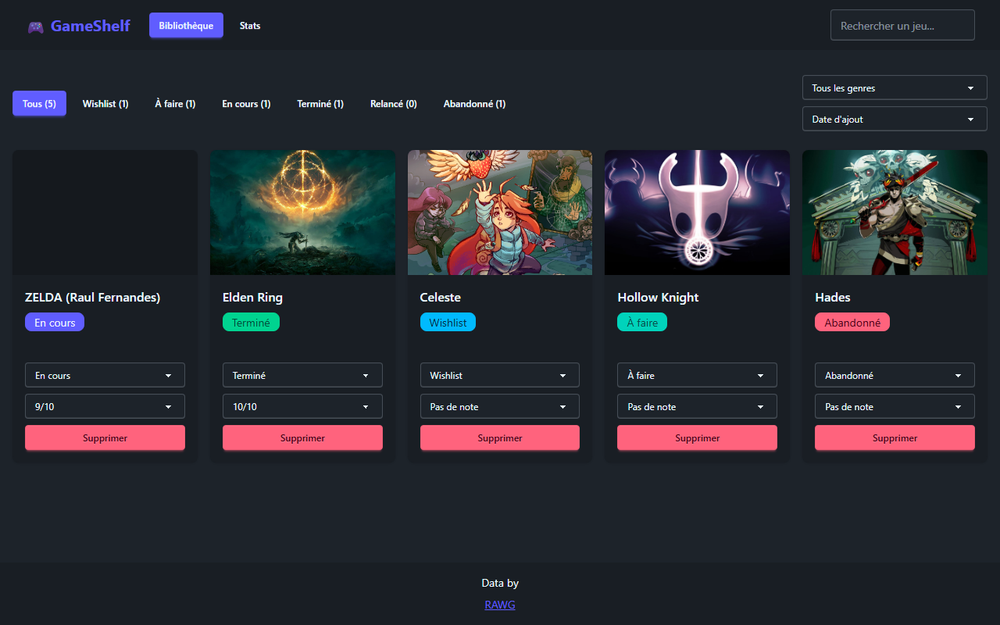
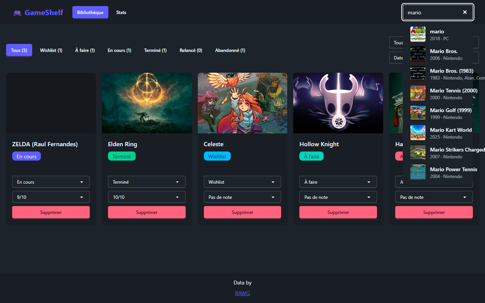
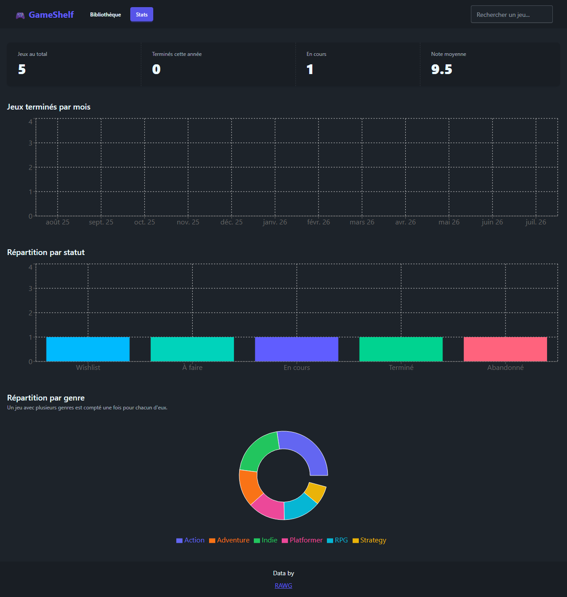

# GameShelf 🎮

[](https://github.com/LaurentKoehler/gameshelf/actions/workflows/ci.yml)

A web app to manage your video game backlog: search any game through the RAWG API, add it to a personal library with a status, rate it, and visualize your gaming habits with charts.

Every gamer has a "pile of shame" — games bought but never launched, started but never finished. GameShelf helps you take back control.



**Live demo:** coming soon — see [Step 8: Deploy to production](https://github.com/LaurentKoehler/gameshelf/issues/20).

## Features

- 🔍 **Search & add** — search RAWG's catalog as you type, add any game to your library with a starting status ([US-1](SPEC.md), [US-2](SPEC.md))
- 📚 **Library** — browse your collection as a card grid with cover, colored status badge, and rating ([US-3](SPEC.md))
- ✏️ **Manage a game** — change its status, rate it 1-10, delete it (with confirmation) ([US-4](SPEC.md))
- 🔁 **Replays** — mark a finished game as "Relancé" (replaying) without losing track of when you first finished it ([US-4b](SPEC.md))
- 🔎 **Filter & sort** — by status (with live counts), by genre, and by date added / alphabetical / rating / Metacritic, all combinable ([US-5](SPEC.md))
- 📊 **Stats** — totals, completions per month, and breakdowns by status and by genre, with colors consistent across every chart and badge ([US-6](SPEC.md), [US-6b](SPEC.md))




## Tech stack

- [Vite](https://vite.dev) + [React](https://react.dev) + TypeScript
- [Tailwind CSS](https://tailwindcss.com) + [DaisyUI](https://daisyui.com)
- [Recharts](https://recharts.org) for the stats charts
- `localStorage` for persistence (no backend in v1)
- [RAWG](https://rawg.io) API for the game catalog
- [Vitest](https://vitest.dev) + [React Testing Library](https://testing-library.com/react) for tests, [oxlint](https://oxc.rs/docs/guide/usage/linter) for linting

## Running locally

Requires a free [RAWG API key](https://rawg.io/apidocs).

```bash
npm install
cp .env.example .env
# then set VITE_RAWG_API_KEY in .env
npm run dev
```

## Testing and CI

```bash
npm test        # Vitest + React Testing Library
npm run lint     # oxlint
npm run build    # tsc -b && vite build
```

A GitHub Actions workflow runs all three on every push and pull request — a PR can't merge with a broken build, a lint violation, or a failing test.

## How this project was built

GameShelf is a portfolio project built collaboratively with [Claude Code](https://claude.com/claude-code), following a deliberately spec-first workflow rather than "vibe coding":

1. **Spec first.** [`SPEC.md`](SPEC.md) defines the product as user stories, each with Gherkin-style acceptance criteria (Given/When/Then) and explicit business rules, split between domain rules (e.g. "a game can only exist once in the library") and purely technical notes (e.g. debounce timing). The spec is a living document — new decisions get written down before code changes.
2. **One step, one branch, one PR.** The build follows `SPEC.md`'s step list, one step at a time. Each step gets its own branch and pull request, reviewed and merged individually rather than as one large drop.
3. **Issues before implementation.** Bugs and new micro-stories are filed as GitHub issues with their acceptance criteria *before* the branch is created, so the PR that fixes or implements them can close a specific, pre-agreed issue. Two concrete examples:
   - The "replaying" status was a product decision, specced as Gherkin acceptance criteria and approved before a line of code was written ([issue #7](https://github.com/LaurentKoehler/gameshelf/issues/7)).
   - An external code review's findings were verified, filed as one issue, and fixed with a regression test per finding ([issue #13](https://github.com/LaurentKoehler/gameshelf/issues/13)).
4. **CI as a gate, not a formality.** Every PR runs the full test suite, the linter, and a production build. Green CI is a precondition for review, not just a status badge.
5. **The human's role.** Claude Code writes the code, the tests, and the commits — but every product decision (what a status transition should do, what the default status is, whether a color choice is accessible enough), every PR review, and all acceptance testing (does it actually work in a real browser, not just in the test suite) stayed with a human. Claude Code proposed and drafted; the product owner decided and approved.

The repo's [closed issues](https://github.com/LaurentKoehler/gameshelf/issues?q=is%3Aissue+is%3Aclosed) and [merged pull requests](https://github.com/LaurentKoehler/gameshelf/pulls?q=is%3Apr+is%3Amerged) are the audit trail of this whole workflow, from the first spec to the latest fix.

## Known limitations

- **The RAWG API key is visible client-side** — it ships in the built JavaScript bundle, since this is a backend-less v1. Planned v2 fix: a small backend proxy that holds the key server-side.
- **A game keeps only its single most recent completion date** (`finishedAt`). Finishing a game, replaying it, and finishing it again overwrites the earlier date — GameShelf doesn't (yet) keep a full history of every completion.
- **Data lives in one browser's `localStorage`** — no accounts, no cross-device sync. This is a deliberate v1 scope choice, not a bug.

## Roadmap

- [Step 8: Deploy to production](https://github.com/LaurentKoehler/gameshelf/issues/20) — production deploy with a live demo link.
- [v2: Status change history (event log)](https://github.com/LaurentKoehler/gameshelf/issues/21) — record every status transition with its own date, removing the single-completion-date limitation above and enabling a chart of status changes over time.
